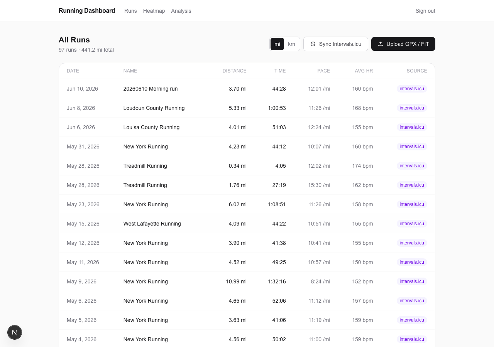
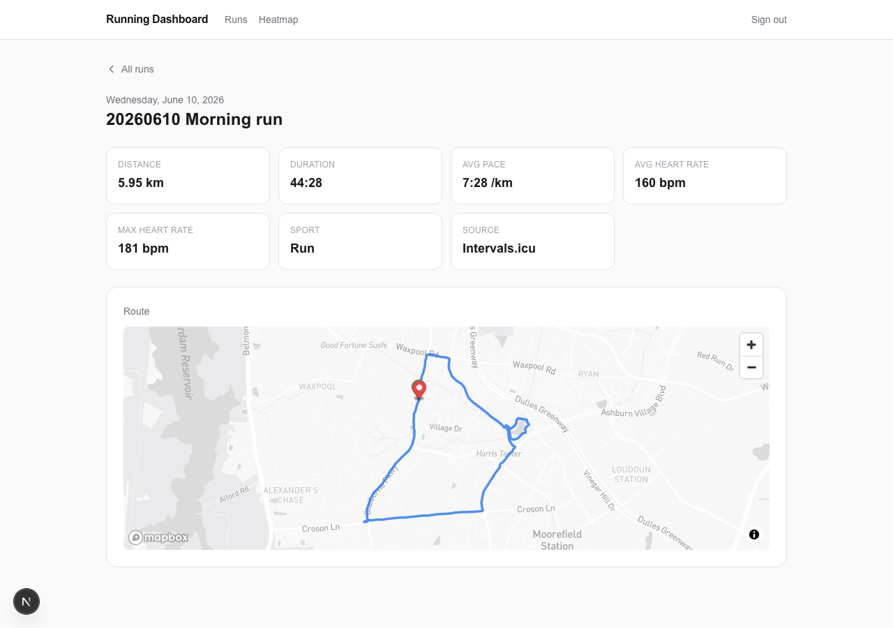
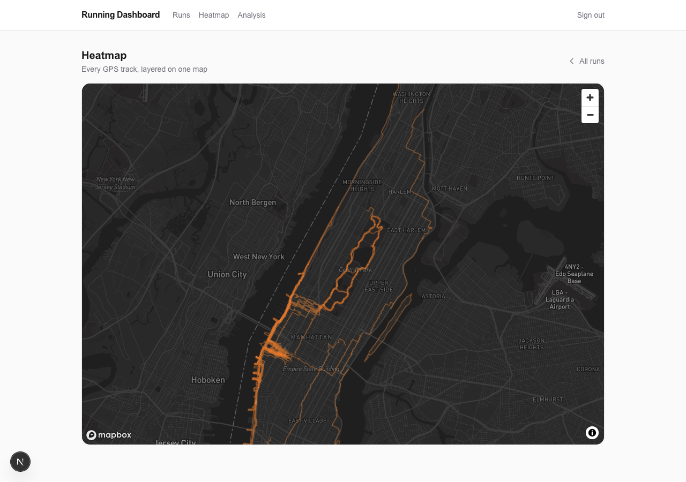
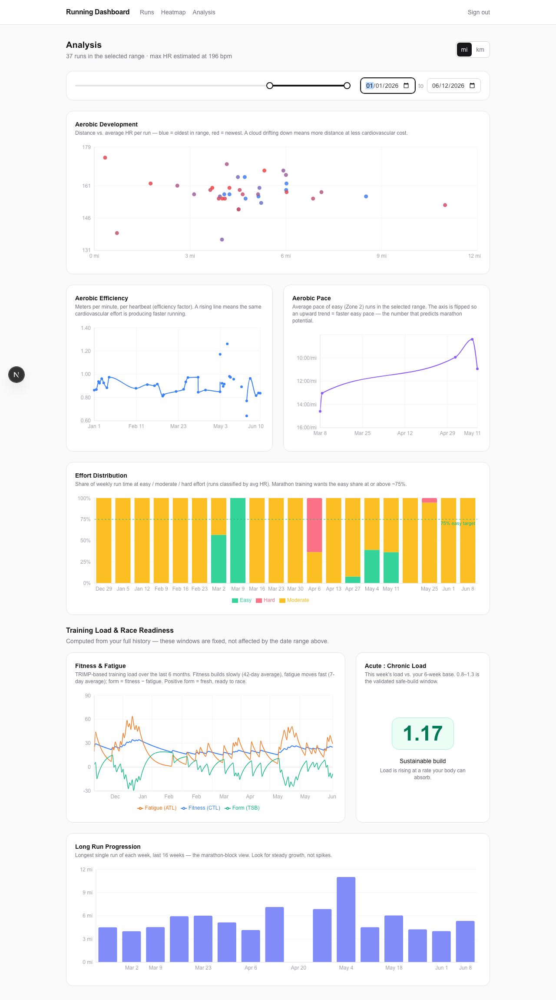

# Running Planning

## Goals
- Connect data to Garmin or Strava
- List out my runs
- Create visual maps for each run
- Create dashboard for analyzing runs

---

## What it does

A personal running dashboard for a single authenticated user. Pulls activity data from Intervals.icu (which aggregates Garmin and Strava), lets you upload GPX/FIT files directly, and turns it all into coaching-grade analysis.

### Runs list

Every activity in one place — distance, time, pace, heart rate, and source. Toggle between miles and kilometers; preference is remembered across sessions.

### Run detail & route map

Click any run to see the full stats breakdown and a GPS route map rendered with Mapbox, with a green start marker and red finish marker.

### Heatmap

All GPS tracks layered on a single dark map, centered on Manhattan. Repeated routes glow brighter — your training geography at a glance.

### Analysis

A dedicated analysis page with a date-range slider (default: last 2 weeks, adjustable to your full history). Every aerobic chart updates live as you scrub.

- **Aerobic Development** — distance vs. avg HR scatter, colored by date. A cloud drifting down = more distance for less cardiac cost.
- **Aerobic Efficiency** — meters per minute per heartbeat over time. Rising = faster running at the same cardiovascular effort.
- **Aerobic Pace** — easy (Zone 2) runs plotted over time; the y-axis is flipped so up = faster. The clearest long-term aerobic base signal.
- **Effort Distribution** — weekly easy/moderate/hard breakdown by time, with the 75%-easy marathon training target marked.
- **Fitness & Fatigue** — TRIMP-based CTL/ATL/TSB curves over 6 months: fitness builds slowly, fatigue moves fast, form = the difference.
- **Acute:Chronic Load** — color-coded injury-risk ratio (green 0.8–1.3 = safe build, amber = caution, red = overreach).
- **Long Run Progression** — longest run per week over the last 16 weeks.

---

## Tech stack

| Layer | Choice |
|---|---|
| Framework | Next.js (App Router) |
| Database | PostgreSQL + Prisma |
| Auth | NextAuth.js (single-user credential login) |
| Maps | Mapbox GL JS |
| Charts | Recharts |
| Styling | Tailwind CSS |
| Deployment | Vercel |

